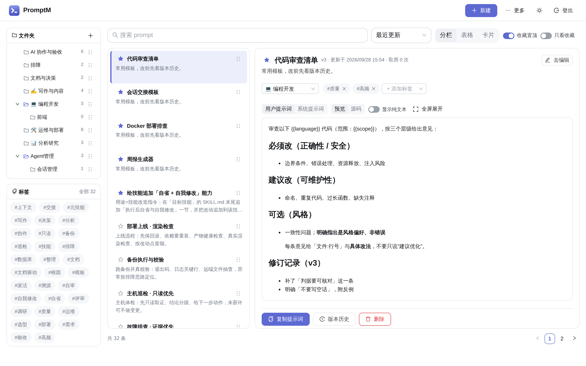
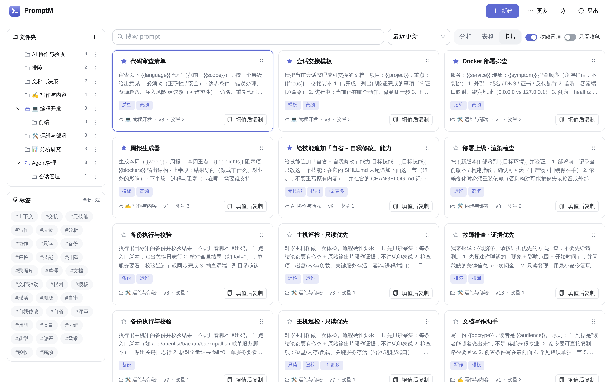
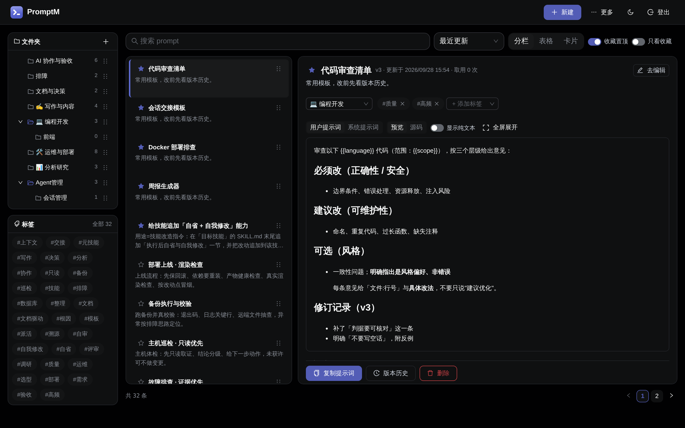

# promptmanager

**轻量、自托管、数据自持的 Prompt 管理器。** 一个进程、一个端口、一个数据库文件，浏览器打开就能用。
不联网、不发遥测 —— 数据全在你自己机器上。

[](https://github.com/Hopetree/promptmanager/actions/workflows/ci.yml)
[](LICENSE)
[](https://hub.docker.com/r/hopetree/promptmanager)
[](.nvmrc)

MIT 许可 · 镜像 `hopetree/promptmanager` · 需要 Node ≥ 24（源码运行时）

## 能做什么

- **结构化保存**：标题 / 用户提示词 / 系统提示词 / 备注 / 文件夹 / 标签 / 收藏
- **中文全文检索**：标题、正文、备注一起搜；≥3 字走 FTS5，两字词走全表兜底
- **三种视图**：分栏（桌面默认，左筛选中详情）、表格（信息密度高，支持批量）、卡片（移动端默认）
- **模板变量**：自动识别 `{{变量名}}`（支持中文）→ 填值 → 渲染成品；**没填的变量原样保留**
- **版本历史**：每次保存自动留档，任选两版看差异（红删绿增）、一键回滚（回滚也生成新版本，不覆盖历史）
- **Markdown 预览**：服务端渲染 + XSS 净化 + 代码高亮
- **给脚本与 agent 用**：API Token + 使用侧 CLI（`pm get` / `pm render`）+ 只读 MCP（本地 stdio 或远程 HTTP，见 [接口参考](docs/api.md)）
- **移动端与暗色**：手机浏览器可用（单栏 + 抽屉）；主题跟随系统，也可手动三态切换

其它能力（拖拽排序、批量操作、导入导出、使用统计、文件夹嵌套、令牌分权限等）见下方「怎么用」。

## 看一眼

> 截图按 **2880×1800**（2× 缩放）出图，**竖排**展示以便看清界面细节。
> 想看全部 8 张（表格 / 编辑器 / 详情与版本对比 / 移动端 / 登录页）见 [`docs/shots/`](docs/shots/)。

**分栏视图**（桌面默认：左侧筛选中栏列表、右侧详情）



**卡片视图**（移动端默认）



**暗色主题**



## 快速开始

### Docker（推荐）

需要 Docker ≥ 20.10。官方镜像发布在 **Docker Hub**（public）：

```
hopetree/promptmanager
```

镜像由 CI 在推**正式版** tag（如 `v1.4.0`）时构建发布；**预发布 tag**（如 `v2.2.2-beta.1`）只构建、不推送 —— 所以 `latest` 与各版本号**永远指向正式版**。国内网络拉不动怎么办，见下方「常见问题」。

```bash
# ① 拉取（若卡住或很慢 / 超时，见下方「拉不动怎么办」）
docker pull hopetree/promptmanager:latest

# ② 运行（数据落在宿主目录，容器重建不丢）
docker run -d --name promptmanager \
  -p 8767:8767 \
  -v "$PWD/data:/data" \
  hopetree/promptmanager:latest

# ③ 首次设置管理员口令（只从 stdin 进库，不进环境变量、不进镜像）
printf '%s\n' '你的强口令' | docker exec -i promptmanager \
  node bin/pm.mjs user set-password --username admin

# ④ 自检
curl -s http://127.0.0.1:8767/healthz     # 形如 {"status":"ok","version":"1.5.0"}（版本号随发版变化）
```

浏览器打开 `http://<主机>:8767/`，用 `admin` + 刚设的口令登录。

> **拉不动？** 多半是网络到 Docker Hub 不通（不是你的环境坏了）。换镜像站拉下来再 `tag` 回规范名，或给 Docker 配代理 —— 详见下方「常见问题」。


### 源码运行

```bash
npm ci                       # 按 package-lock.json 冷装；better-sqlite3 预编译二进制随包分发
npm run build                # 服务端 tsc + 前端 vite
npm run migrate              # 初始化数据库（幂等；服务启动时也会自动迁移）
printf '%s\n' '你的强口令' | node bin/pm.mjs user set-password --username admin
npm start                    # 默认 0.0.0.0:8767
```

systemd 部署见 [`deploy/README.md`](deploy/README.md)。

## 怎么用

顶栏 `＋新建` 建条目（**保存后才入库**），`⋯更多` 里有使用统计 / API 令牌 / 导入导出 / 关于 / 修改密码 / 登出。

**三种视图** —— 手机上自动降级为单栏，点条目开详情抽屉：

| 视图 | 特点 |
| --- | --- |
| **分栏**（桌面默认） | 左栏筛文件夹与标签，中栏列表，右栏详情 |
| **表格** | 信息密度最高，支持行内编辑/删除/复制与**勾选批量操作** |
| **卡片**（移动端默认） | 一条一张卡，正文摘要最直观 |

**常用操作**：

| 想做的事 | 怎么做 |
| --- | --- |
| 复制成品 | 列表 / 卡片 / 详情 / 编辑器里的「复制」；含变量时会先让你填值 |
| 填变量 | 详情或编辑器的变量面板 → 填值 → 预览 → 复制（渲染不写库） |
| 看历史 / 回滚 | 详情或编辑器的版本面板：选两版看差异，或一键回滚 |
| 改文件夹 / 标签 | 详情页标题下的元信息行：文件夹下拉直接改，标签可增删（即时生效） |
| 排序 | 直接拖动卡片 / 列表项 / 表格行 / 文件夹（排序方式选「自定义」时按你的顺序）|
| 批量处理 | 切到表格视图 → 勾选 → 顶部工具条批量收藏 / 移动 / 删除 |
| 导入导出 | `⋯更多 → 导入 / 导出`；导入前会预览将新增多少条 |
| 换口令 | `⋯更多 → 修改密码`（改完当前会话保持登录，其它设备会被登出） |
| 给脚本 / agent 用 | `⋯更多 → API 令牌` 建令牌；默认**只读**，可随时点「复制」再取明文 |

**快捷键**：`/` 或 `Ctrl/Cmd + K` 聚焦搜索，`Esc` 关闭当前浮层。

**变量写法**：正文里写 `{{变量名}}`（支持中文、不能有空格）；想输出字面量 `{{...}}` 用 `\{{转义}}`。

### 远程 MCP 接入

内置**只读** MCP 端点，AI 客户端填 URL + 认证头即可，**不需要在客户端机器上放任何副本**：

| 客户端里填 | 值 |
| --- | --- |
| 传输方式 | **Streamable HTTP** |
| URL | `http://<服务地址>:8767/mcp` |
| 认证头 | `Authorization: Bearer <你的 API 令牌>` |

提供三个只读工具：`prompt_search` / `prompt_get` / `prompt_render`，**没有任何写操作**；
每次取用都会记入使用记录。端点是**无状态**的（只用 POST 发 JSON-RPC）。
若前面有反向代理，记得把 `/mcp` 路径转发过来并**透传 `Authorization` 头**。完整用法见 [接口参考](docs/api.md)。

### 远程数据同步（手动推 / 拉到 GitHub 私有仓库）

`⋯更多 → 远程数据同步`：把**全量快照**手动推到自己的 GitHub 私有仓库（或从那里恢复），换台机器就能接着用。
快照就是「导入 / 导出」的同一份 JSON（`app: promptmanager` + `schema_version: 1`），
恢复也走同一个导入实现（默认 `merge` 追加，可选 `replace` 清空重建）—— **不是另造一套格式**。

| 配置项 | 说明 |
| --- | --- |
| 仓库 | `owner/repo`；粘贴网页地址或 SSH 地址也行，保存时归一化 |
| 实例名 | 只允许字母数字与 `._-`；留空则取访问地址的主机名 |
| 仓库内路径 | **必须包含 `promptmanager/`，并以 `<实例名>.json` 收尾**（如 `promptmanager/pm.json`），否则保存会被拒 |
| 分支 | 留空即 `main` |
| GitHub 令牌 | **加密落库**（复用本项目的令牌加密机制）；读接口只回"已设置 + 尾 4 位"，永远不回明文 |

三个动作，**全部手动触发**：

- **测试连接**：区分"令牌无效 / 该仓库无权限 / 仓库或路径不存在 / 云端还没有这个文件"四种结果。
- **立即上传**：先做一次只读预览（`dry_run`），界面弹二次确认，写明**将推送多少条 prompt / 多少个文件夹**、
  **解析后的完整目标路径**、是新建还是覆盖，并明示**快照包含提示词正文全文**；确认后才真正写入。
  单文件超过 **5 MB** 会被拒绝（导出体积远小于这个数）。
- **从云端恢复**：`merge` 只新增不删本地；`replace` 会清空并重建，需要二次确认，且服务端会在清空前
  自动写一份本地快照（`<DATA_DIR>/pre-restore-<时间戳>.json`，最多保留 3 份）。

**令牌请用最小权限**：GitHub → Settings → Developer settings → **Fine-grained tokens**，
只勾选**这一个仓库**，权限只给 **`Contents: Read and write`**；**不要复用你的个人 personal token**，
也不要把令牌贴进任何文件、脚本或 issue（本项目只在服务端加密保存它）。

⚠️ **两条要知道的限制**：① **删除不会传播到云端** —— 本地删掉的 prompt 不会去删云端快照里的对应内容；
② 没有自动 / 定时上传，每次出网都由你在界面上点击触发（与"不主动出网"的项目口径一致）。
同步接口 `/api/sync/*` **只允许浏览器会话**调用，用 API 令牌调会返回 `403 session_required`。

## 备份与升级

- **备份**：在 `⋯更多 → 导入 / 导出` 里导出全量 JSON（含版本历史），这是最省事也最完整的方式。
  服务端数据是 `DATA_DIR` 下的 `pm.db`（SQLite，**WAL 模式**）+ `media/`。
  ⚠️ **不要在服务运行时直接拷 `pm.db`** —— WAL 里未落盘的写入会丢；要取文件请用一致性快照
  （`VACUUM INTO`）或把 `pm.db`、`pm.db-wal`、`pm.db-shm` 三个文件一起拷走。
  **本项目不内置自动备份**，需要自动化请自行挂定时任务，示例见 [`deploy/container.md`](deploy/container.md)。
- **升级（Docker）**：`docker pull hopetree/promptmanager:<新版本>` → 停旧容器 → 用**同一个数据卷**起新容器。
- **升级（源码）**：拉新代码 → `npm ci && npm run build` → 重启；启动时自动跑数据库迁移。
- **回滚**：Docker 用旧 tag 的镜像起容器；源码 `git checkout` 到上一个提交重新构建。
  迁移是**向前兼容**的（只增不删），一般无需动数据。

## 常见问题

**拉取镜像很慢或失败？**
多半是网络到 Docker Hub 不通（国内常见），不是你的环境有问题。两种办法：

```bash
# ① 换镜像站拉，再 tag 回规范名（后续命令不用改）
docker pull <镜像站>/hopetree/promptmanager:<版本>
docker tag  <镜像站>/hopetree/promptmanager:<版本> hopetree/promptmanager:<版本>

# ② 给 Docker 配代理（能连外网但慢时）
#    在 /etc/systemd/system/docker.service.d/ 加 HTTP_PROXY / HTTPS_PROXY 后重启 docker
```

> 不写死具体加速站点 —— 各家可用性会变，挑你所在网络里能用的那个：公司内网 registry、云厂商加速器、公开镜像站都行。
> 若镜像站给的是扁平名（`<镜像站>/promptmanager`），把 `<镜像站>/hopetree` 整段替换成它给的名字。

**忘记管理员口令？**
在服务所在主机上重设（覆盖式，不需要旧口令）：

```bash
# 源码运行
printf '%s\n' '新口令' | node bin/pm.mjs user set-password --username admin
# Docker 运行
printf '%s\n' '新口令' | docker exec -i promptmanager node bin/pm.mjs user set-password --username admin
```

注意：这会**吊销该用户全部已登录会话**，包括你当前浏览器里的。

**数据存在哪？**
`DATA_DIR` 下的 `pm.db` + `media/`。Docker 形态默认 `/data`（对应你挂载的宿主目录）；源码形态默认项目下的 `data/`。

**放在反向代理后面要注意什么？**
只在确有反代时设这两个变量；**内网 HTTP 直连时都留空**（设了 `PUBLIC_ORIGIN` 会让 cookie 带 `Secure`，HTTP 下反而登录不上）：

```bash
TRUST_PROXY=1                              # 来源 IP 取 X-Forwarded-For（登录限流按真实来源计）
PUBLIC_ORIGIN=https://prompt.example.com   # 会话 cookie 追加 Secure
```

服务本身**不做 TLS**，公网访问请在前面放反代终结 HTTPS。样例见
[`deploy/reverse-proxy.example.conf`](deploy/reverse-proxy.example.conf)。

**端口被占 / 复制按钮点了没反应？**
换端口启动即可（源码 `PORT=8768 npm start`；Docker 改 `-p` 的宿主端口，容器内保持 `8767`）。
复制按钮在内网 `http://`（非 HTTPS）下会被浏览器安全策略拦住，程序会自动退回兼容方式，仍被拦时界面会提示手动复制 —— 不是服务故障。

**升级后数据会不兼容吗？**
不会。迁移幂等且只增不删；导入导出 JSON 带 `schema_version`，导入时会校验并拒绝不兼容的文件。

## 已知限制

- **单用户**：一套账号口令，没有多用户与权限分层；请只暴露在可信内网，或由反代加一层访问控制。
- **服务不做 TLS**：公网形态必须由反代终结 HTTPS。
- **没有 URL 深链**：界面状态存在应用内，刷新回到列表，浏览器前进/后退不参与导航。
- **搜索是"提交后查询"**：有约 300ms 防抖，不是逐字符即时搜索。
- **中文检索边界**：≥3 字走全文索引；两个字走全表兜底（2000 条量级实测 0.2ms，数据量到十万级需重新评估）。
- **版本只留最近 10 个**：更早的会被真删，回滚到已清理的旧版本会提示"版本不存在"。
- **变量填值不持久化**：渲染结果不写库，切换条目会清空已填的值。
- **MCP 端点无状态**：不支持长连接会话 / 服务端推送，只支持请求-响应式只读调用。
- **不含**：RAG / 向量检索 / AI 调用、多语言界面、桌面或移动 App、对象存储与外部同步。

## 文档索引

| 想看什么 | 看哪份 |
| --- | --- |
| 部署与使用（本文件） | `README.md` |
| 接口 / CLI / MCP 参考 | [`docs/api.md`](docs/api.md) |
| 容器部署细节（构建 / 镜像发布 / 备份 / 排错） | [`deploy/container.md`](deploy/container.md) |
| systemd 部署（安装 / 验证 / 回滚） | [`deploy/README.md`](deploy/README.md) |
| 界面截图 | [`docs/shots/`](docs/shots/) |
| 更新日志 | [`CHANGELOG.md`](CHANGELOG.md) |
| 版本管理与发版规则 | [`docs/versioning.md`](docs/versioning.md) |
| 依赖清单与许可证 | [`docs/dependencies.md`](docs/dependencies.md) |
| 开发者文档（构建 / 测试 / 项目结构 / 验收） | [`docs/development.md`](docs/development.md) |
| AI 代理操作指南 | [`AGENTS.md`](AGENTS.md) |
| 参与贡献 / 提 PR | [`CONTRIBUTING.md`](CONTRIBUTING.md) |
| 安全策略 / 报告漏洞 | [`SECURITY.md`](SECURITY.md) |
| `docs/` 里有什么、还算不算数 | [`docs/README.md`](docs/README.md) |

## 参与

欢迎 issue 与 PR。开工前请读 [`CONTRIBUTING.md`](CONTRIBUTING.md)（环境、质量门、几条硬规矩）；
提交前跑一遍 `rm -rf dist && bash tools/ci-check.sh`。

**安全漏洞请不要开公开 issue** —— 走 [`SECURITY.md`](SECURITY.md) 的私密渠道。

## License

[MIT](LICENSE) © 2026 Hopetree
